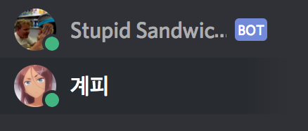

# Discord ChatBot 개발기

배그중... 스쿼드팟에서 배그 서버상태나 알려주는 봇이 있으면 좋겠다는 이야기가 나왔다. 스쿼드 하면서 이름까지 다 만들어진 상태라 나 대신 만들어 주기를 바랬으나.... 아무도 안 만들어 주더라... 개발자가 2명이나 있으면서...

어쨌든 Java와 python 중 python이 편할거라고 틀린 판단을 하고 개발을 시작했다.


## Stupid Sandwich!

url = https://discordapp.com/oauth2/authorize?client_id=387217825950859284&scope=bot


### 1. HOW ?

먼저 스쿼드가 끝나고 가볍게 설계를 시작했다.

1. 단순하게 제작한다
2. 크롤링 공부도 하자
3. 빠르고 아름다운 파이썬을 쓰자

라는 이상한 과정으로 개발을 시작했다. 물론 파이썬을 잘 모르는데 파이썬을 쓰다보니까 상당히 개발하는데 애를 먹기는 했다.

### 2. Find API!

API를 만들것이 아니라면 API를 가져다 쓰면 된다.

https://github.com/Rapptz/discord.py

이 곳이 파이썬 Discord api 이다.

```python
python3 -m pip install -U discord.py
```

로 간단하게 설치 할 수 있다.

#### Quick Example

```Python
import discord
import asyncio

client = discord.Client()

@client.event
async def on_ready():
    print('Logged in as')
    print(client.user.name)
    print(client.user.id)
    print('------')

@client.event
async def on_message(message):
    if message.content.startswith('!test'):
        counter = 0
        tmp = await client.send_message(message.channel, 'Calculating messages...')
        async for log in client.logs_from(message.channel, limit=100):
            if log.author == message.author:
                counter += 1

        await client.edit_message(tmp, 'You have {} messages.'.format(counter))
    elif message.content.startswith('!sleep'):
        await asyncio.sleep(5)
        await client.send_message(message.channel, 'Done sleeping')

client.run('token')
```

예제를 보면 몇가지만 보면 된다.

```Python
async def on_message(message):
```

이 부분으로 discord 채팅창에 메세지를 출력해준다.

문제는 이 부분이 async로 되어 있다는점...

### 3. Make Server!

집에 있는 도커 서버를 그냥 사용하기로 했다.

Ubuntu 도커를 설치한 후 python3 를 설치하고 몇가지 보안설정을 끝내고 vim으로 개발을 한다.

### 4. Develop!

뭐 Dev-Ops 설정할 필요가 있나해서 서버에 붙어서 바로 작업을 시작했다.

첫번째 설계는

      1. 사용자의 요청이 온다.
      2. https://bglog.me/ 에서 크롤링을 한다.
      3. 정상과 느림 서버터짐을 출력해준다.

하지만 생각해보니까 갑자기 여러명의 요청이 들어오면 여러번 크롤링 해야 하는데 그럴 필요가 있냐는 생각이 들었다.

두번째 설계로.

      1. 백그라운드로 https://bglog.me/를 크롤링 하는 쓰레드가 돌고있다.
      2. 요청이 오면 전역변수를 참조, 반환한다.
      3. 정상과 느림 서버터짐을 출력한다.

로 잡고 개발을 했다.

   

여기서 문제가 생겼다.

원래 사용하려던 while(true)로 코드를 작성하자 

   ```Python
   async def on_message(message):
   ```

이 작동을 안한다. 싱글 쓰레드인 파이썬에서는 무한루프가 실행되자 on_message function이 작동하지 않는 것이었다.

결국 부랴부랴 비동기를 공부... 

   ```python
   @asyncio.coroutine
   def bs4store():

   code = requests.get(url)
   plain_text = code.text
   soup = BeautifulSoup(plain_text, 'lxml')
   text = soup.select('body > div.i-container > div.server.box > i')
   text2 = soup.select('body > div.i-container > div.online.box')
   out = text2[0].find('span').text

   print(out.encode('euc-kr'))
   outtext = str(text[0])

   if(outtext.find(type1)):
       value = 0
   elif(outtext.find(type2)):
       value = 1
   elif(outtext.find(type3)):
       value = 2

   yield from asyncio.sleep(loading_time)
   asyncio.async(bs4store())
   ```

로 다시 코드를 짰다. 사용한 라이브러리는 크롤링 라이브러리로 유명한 BeautifulSoup이다.

### 5. Launch!

Discord에 봇 등록을 마치고 실험용으로 채널을 생성... 올려보았다.

 

(고든램지님 사랑합니다.)

봇 등록이 되면 BOT 표시가 된다.

채팅창에 !sandwich 를 입력, 'Great Sandwich!'(정상),  'SoSo Sandwich!'(느림), 'Fuck Sandwich!(불통)'

을 출력하게 되어있고 크롤링이 안되어 있다면 'Store is Close!(서버 준비중)' 가 된다.

### 6. Finally....

재미로 만든 봇인만큼 시간이 많이 걸리줄은 몰랐다 4시간만에 제작하기는 했지만 비동기에 2시간 정도 소모한거 같다. 역시 멀	  티쓰레드 프로세스를 쓸꺼같으면 그냥 자바 써야겠다....