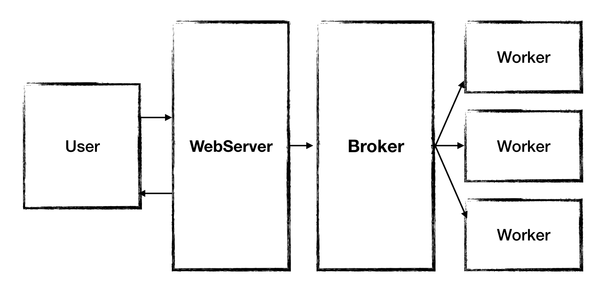

DockerMon 개발 -2 [Celery Worker]

django 에서 montioring 하는 funtion을 돌리기 위해서는 동기 방식이 아닌 비동기 방식의 방법이 필요했다.

그래서 찾은 방법이 Celery 와 Rabbitmq를 사용한 방식을 사용하여 json파일을 만드는 방식으로 테스트를 진행했다.

간단하게 테스트를 하기 위해서 json파일을 만들고, 나중에 ajax를 사용하여 자동으로 업데이트 해주면 될 것이다.

celery란?

Python 특성상 단일 쓰레드로 작동하기 때문에 응답을 받기까지 오래 걸릴 수 있다. 그렇게 되면 사용자들이 불편을 느끼기 때문에 비동기로 작업을 처리, 결과 값만 return받는 경우가 많다. celery는 여기서 작업을 도와주기 위한 프레임워크다. 그리고 보통 이런 프레임 워크를 worker라고 한다.

Celery설치

우분투 환경에서 서버 작업을 하기 때문에 pip를 이용해서 설치한다.

sudo pip3 install celery

를 사용해서 설치한다. python3.5를 사용하기 때문에 pip3를 사용한다.

각각의 작업은 Worker로 분류되고 Worker에 요청되는 작업은 Broker에 큐 형태로 저장되고 분배된다. 여기서는 Broker 로 rabbitmq를 사용하기로 했다.

rabbitmq를 설치하는 방법은 아래와 같다

sudo apt-get install rabbitmq-server

rabbitmqctl add_user User Password #user 추가

#만약 rabbitmq를 정지하려면 rabbitmqctl stop명령어로 중지시킨다.

https://github.com/celery/celery/tree/master/examples/django 를 참고해서 django에 예제 프로젝트를 생성, 실행시킨다.

Starting the worker

$ celery -A 프로젝트 worker -l info

Running a task

`$ python ./manage.py shell
>>> from app.task import add, mul, xsum`
>>> `>>> res = add.delay(2,3)`
>>> `>>> res.get()`
>>> `5`

