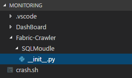

빠르게 웹을 찍어 내야하다 보니 자바스크립트를 사용한 기교는 최대한 덜 부리고 완성을 목표로 개발하게 되었네요. Bash랑 Python이랑 Javascript를 다 쓰게 생겼는데 어쩌다보니 스크립트 파티가 되었네요 여튼 오늘도 진행해봅시다.


### 그 다음 해야 할 일은?

대충 프론트 설계가 끝났으니 Back을 설계해야 합니다. 어제 Post로 Data를 넘겨받는것 까지 개발을 했기 때문에... 이제 넘겨받은 Data를 File로 작성해 봅시다.

```javascript
var firesystem =require('fs');

firesystem.writeFile('../crash.sh', data ,'utf-8', function(error){
            console.log('데이터 작성 실험 함수');
});
```

File System이 상당히 쉽게 (?) 작성되어 있는데 덕분에 출근하자마자 빠르게 파일 작성하는 부분을 해결할 수 있었습니다.

appendFile과 writeFile중 무엇을 사용해야 하나 고민이 되었지만 appendFile의 경우 기존의 존재하는 파일에 이어서 작성하는 것이고 writeFile은 처음부터 재 작성하게 됩니다.


성공적으로 파일을 작성했으니 다음 작업으로 넘어가 봅시다.


### 문자열을 만들자...

Bash Script에 작성될 문자열을 만들자. 사실 단순하게 Python Script를 동작시키는 것이기 때문에

```bash
python3 test_script.py argv
```

하면 될 것이다... 하지만 이걸 하기 위해서는 Python Script를 한번 정리해야 합니다.

현재 3개의 스크립트가 존재하고 이 3개는 전부 InfluxDB를 사용합니다.


### 어? Python이 먼저네...

InfluxDB에 Insert하는 부분을 모듈화 시키고 3개의 script에서 참고한다면 편할 것이죠.

먼저 Python Project의 형태를 만들자 먼저 InfluxDB.py를 작성할 패키지를 만들어 봅시다.



위와 같은 디렉토리 구조를 만들고 ```__init__.py``` 를 작성해 줘야 합니다. 그래야 Python에서 패키지로 인식해 정상적인 import를 시켜주기 때문이죠

InfulxDB말고도 다른 DB를 사용하기 때문에 쿼리문을 모아두는 의미를 담아 SQLMoudle이라고 적어둡니다.


InfluxDB Module을 설치하는 동안 심심하니 InfluxDB을 Python에서 쓰는걸 적어보자면 공식 라이브러리는 아래와 같이 [InfluxDB Github](https://github.com/influxdata/influxdb-python)에 메뉴얼이 있습니다.

```pip install influxdb```명령어를 통해 module을 설치하고 사용해주면 됩니다.

```python
from influxdb import InfluxDBClient

client = InfluxDBClient('localhost', 8086, 'root', 'root', 'example')

def create_db(database_name):
    client.create_database(database_name)

def write_db(json_data):
    client.write_points(json_data)

if __name__ == "__main__":
    print('InfluxDB Client...')
```

기본적인 구조는 이렇게 될 것입니다. 

파이썬을 처음 작성하게 되면 ```if __name__ == ""__main__"":```의 역할이 무엇인지 궁금해 하는데 단순하게 이 Python Script가 모듈로 실행되는 건지 Script 자체가 실행되는것인지 구분하는 역할을 합니다. 테스트 할때 유용하게 사용할 수 있는 부분이기 때문에 Module을 만든다면 적어두고 개발하는 것이 유용합니다.

동작하는 방식은 InfluxDBClient로 Client를 얻어오고 DB를 만든 후, writeDB로 table에 기록해 주면 됩니다. 이때, influxdb가 받는 data는 json입니다.

```python
def create_db(database_name):
    try:
    	client.create_database(database_name)
    except Exception as ex:
        print(ex)
```
로 예외처리까지 해줍시다.

최종적으로 만들어진 Script는 아래와 같습니다.

[InfluxDB.py]

```python
from influxdb import InfluxDBClient

client = InfluxDBClient('localhost', 8086, 'root', 'root', 'example')


def create_db(database_name):
    try:
        client.create_database(database_name)
    except Exception as ex:
        print(ex)


def write_db(json_data):
    client.write_points(json_data)


if __name__ == "__main__":
    print('InfluxDB Client...')
```

이제 상위 Project Folder에 임시로 테스트할 Script를 작성해 봅시다.

[crash.py]

```python
import SQLMoudle.InfluxDB as influx
import sys

a = sys.argv[1]
b = sys.argv[2]


def __make_json_body__():
    json_body = ''
    return json_body


if __name__ == "__main__":
    influx.create_db('Database name')
    json_data = __make_json_body__()

    # Run Run Run...

    influx.write_db(json_data)
```
SQLModule에 만들어준 Python Script를 import 시키고 argv를 사용하기 위해 sys도 함게 import 시켜 줍니다. 여기서 argv[0] 은 파일 이름이 들어가 있기 때문에 argv[1] 번부터 호출해야 합니다.

```__make_json_body__```를 만들어서 json data를 가공하고 influx.write_db를 호출해 기록하면 될 것입니다. 데이터를 가공하는 부분은 따로 적지 않겠습니다.

```python
tags = {'host': 'fabric-monitoring', "region": "as-seoul"}
fields = {'crash': 0, 'lastday': None}

body = {"measurement": None, "tags": tags, "fields": fields, "time": None}
```

이런 식으로 미리 body 형태를 만들어 주고 json 처럼 수정하면 좀 더 깔끔하게 코드가 작성 가능해 집니다.

```python
import SQLMoudle.InfluxDB as influx
from copy import deepcopy
import sys

a = sys.argv[1]
b = sys.argv[2]

tags = {'host': 'fabric-monitoring', "region": "as-seoul"}
fields = {'crash': 0, 'lastday': None}

body = {"measurement": None, "tags": tags, "fields": fields, "time": None}


def __make_json_body__(measurement, fieldData):
    json_body = []
    tp = deepcopy(body)
    tp['measurement'] = measurement
    tp['fields']['crash'] = fieldData[0]
    tp['fields']['lastday'] = fieldData[1]
    tp['time'] = 0000000
    return json_body


if __name__ == "__main__":
    influx.create_db('Database name')
    json_data = __make_json_body__()

    # Run Run Run...

    influx.write_db(json_data)
```

최종적으로 만들어진 형태입니다 여기서 time은 자신이 사용하는 time을 사용하면 됩니다 저는 아래와 같은 방식으로 UTC를 얻어서 사용합니다.

```python
from datetime import datetime

dt = datetime.utcnow()
```

이제 데이터 가공은 알아서 하면 됩니다.

어쨌든 우리는 인자값을 불러오고 influxdb를 모듈화 시켜서 import 하는 부분까지 작성했습니다.


계속...