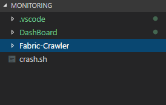
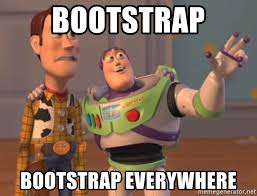
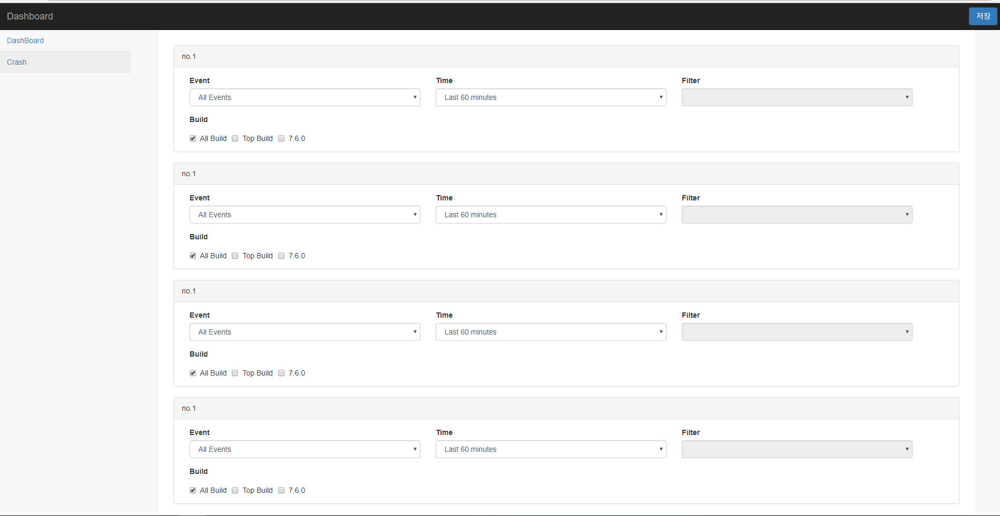

### 인턴 과제중...

인턴 과제로 Python Script로 Crawling 을 하고 해당 Data를 InfluxDB에 기록하는 과제를 받아 수행하던 중에, Python Script에 대한 추가 사항이 늘어나고 추가사항을 계속 Crontab에 등록해 관리하고 있었다.


### 요구사항이 늘어나네...

그렇게 Crontab 을 사용해서 Python Script를 동작시키다 보니 불편한 점 몇 개 발견되었는데

1. Root로 Script가 동작해야 하기 때문에 수정시마다 Root 권한을 얻어야 했다는 점
2. argv 로 Url패턴을 만들고 해당 Url을 Crawling 하는 과정에서 인자값을 수정하기 위해서 Crontab을 수정해야 한다는 점
3. 추가적으로 Script 요청이 들어올 시, 복수의 Script를 Crontab에 등록시켜야 한다는 점

등이 있었다.

뭐... 일일히 수작업으로 수정해줘도 되지만 그 과정마저 귀찮았고 Python Script의 파편화도 슬슬 발생하기 시작해서 Python Module화도 필요했기 때문에 Node.js 로 Web DashBoard를 짜고 Bash Shell 을 활용해서 Crawling Solution을 만드는걸 목표로 해 빠르게 개발해 보았다.

(Node.js가 좋아서 쓴건 아니고 회사에서 Node.js를 쓰길래 인턴 기간 끝나고 유지보수를 위해 Django나 Spring이 아닌 Node.js를 사용했다.)


### 빠르게 웹을 찍어내보자...



구조는 단순하다 DashBoard라는 Node.js Web Project, Fabric 사이트를 Crawling 할 Python Script가 들어있는 Python Project 그리고 이 모든 문제를 해결해줄 우리의 Bash Script


Bash를 채택한 이유는 아래와 같다

1. **Linux System을 사용할 시 가장 빠르고 편리하다**


다른거 없다 단지 저 하나의 이유로 채택했다.

물론 Bash의 경우 여러가지 조건들을 고려해야 겠지만 단순히 인자값만 변경해서 실행시켜 주는 거라면 .sh 파일을 수정하는게 제일 효율적이라고 판단한 것도 있다. 기본적인 구조 설계가 끝났으니 웹 프로젝트 부터 빠르게 제작해보자.

Bash로 Crontab을 관리하면서 몇가지 변경사항이 있었는데.

1. MultiProccessing 이 사라지고 Script 4개를 한개의 Bash에서 실행시키는 단일 스크립트로 변경
2. 시스템 모니터링이 어느 정도 필요하다.
3. 만약 추가적으로 Script를 넣을때는 어떻게?

이 정도 3개의 문제점이 있었고 3번은 깔끔하게 무시하기로 했다.

2번의 경우 Grafana를 사용하는 mornitoring system이기 때문에 telegraf을 사용해서 DashBoard 하나 쯤 만들어 두는 걸로 하고, 뭐... 시간이 남으면 Node.js 에서 보여주는걸로 해보던가 말든가...

1번의 경우 원래 두개의 스크립트 중 한개는 Multiprocessing 다른 한개는 for문으로 동작했는데 Bash로 관리할 경우 굳이 그럴 필요가 없다는 것이다. 물론 웹 적으로 처리해야 할 부분이 늘어나긴 했다.


### 기획만 길면 망하더라.. 빠르게 웹을 찍어내자

일단 만들고, 수정하는게 우선이기 때문에 제일 자신없는 프론트 부터 찍어내기로 했다.



백엔드 개발자의 영원한 친구 BootStarp을 사용했다. React로 프론트를 찍어낼까 도 생각했지만 그렇게 프론트를 자주 변경하는 사이트도 아니고 괜히 일만 커질꺼 같아서 Node.js Express +  Pug 조합으로 개발했다.

Pug < https://pugjs.org/api/getting-started.html

처음 써보는 템플릿 언어인데 EJS보다 빠르게 개발이 가능하다길래 EJS도 몰랐던 나로써는 채택 안할 이유가 없었다. 이 프로젝트의 생명은 속도니까


대충 빠르게 찍어낸 Front의 모습은 아래와 같았다



이거 만드는데 하루가 걸릴줄은 몰랐는데...  여튼 저런식으로 하고 저장을 누르면 Bash Shell에 저장된다

물론 디자인 하느라 하루 종일 걸린거면 자살해야하고 post page의 return 값을 확인하느라 헤맨 부분이 있다.


오늘은 여기까지 하고... 내일 파일 시스템 부분이랑 전체적인 코드 수정을 하면 끝날 프로젝트다.


### 그래서 Back 작업은?

물론 했다. Node.js와 Pug 조합으로 Form에 Post Data를 받는 부분을 헤매긴 했지만 어렵진 않았다.

따로 글을 쓰기에는 너무 간단한 내용이니 여기에 적어보자면, Node.js 에서 Post를 받기 위해서는 아래와 같이 app.js를 만들어 주어야 한다.

```javascript
app.post('/return_post', function (req, res) {
    console.log('Post Page!');
    res.redirect('back');
});
```

form 에는 '/return_post' 부분을 적어둔다

```jade
form#crash-setting(role="form" action='/return_post' method='post')
```

Pug 문법의 특이함이 보인다

이렇게 짜면 html page -> post page -> html page로 redirect를 하고 console에는 Post Page가 찍힌걸 볼 수 있다.

물론 우리는 from에서 Data를 가져와야 하는데 html이 이런 형태를 띄고 있다고 할 때

```html
<form action="/return_post" method="POST">
  <textarea name="data"></textarea>
  <button type="submit">Send</button>
</form>
```

app.js는 아래처럼 작성을 한다.

```javascript
app.post('/return_post', function (req, res) {
    var data =req.data;
    console.log(data);
    res.redirect('back');
});
```

그리고 submit 버튼을 누르면? 에러가 뜬다

req.data 이 부분에서 에러가 뜨는데  body 부분을 인식하지 못하기 때문에 생기는 에러라고 한다.

이를 해결하기 위해 

```bash
npm install body-parser --save
```

body-parser를 설치해준다.

body-parser를 사용할 경우 자동으로 body 부분을 잡아주기 때문에 req.['name'] 으로 data를 불러올 수 있게 된다.


body-parser를 사용하기 위해 app.js 상단부분에

```javascript
var bodyParser = require('body-parser');
```

를 추가해주고 app.post 함수에는

```javascript
app.post('/return_post', function (req, res) {
    var data =req.body.data;
    console.log(data);
    res.redirect('back');
});
```

이런식으로 코드를 작성하면 data를 받아오는걸 확인할 수 있다.