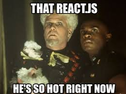
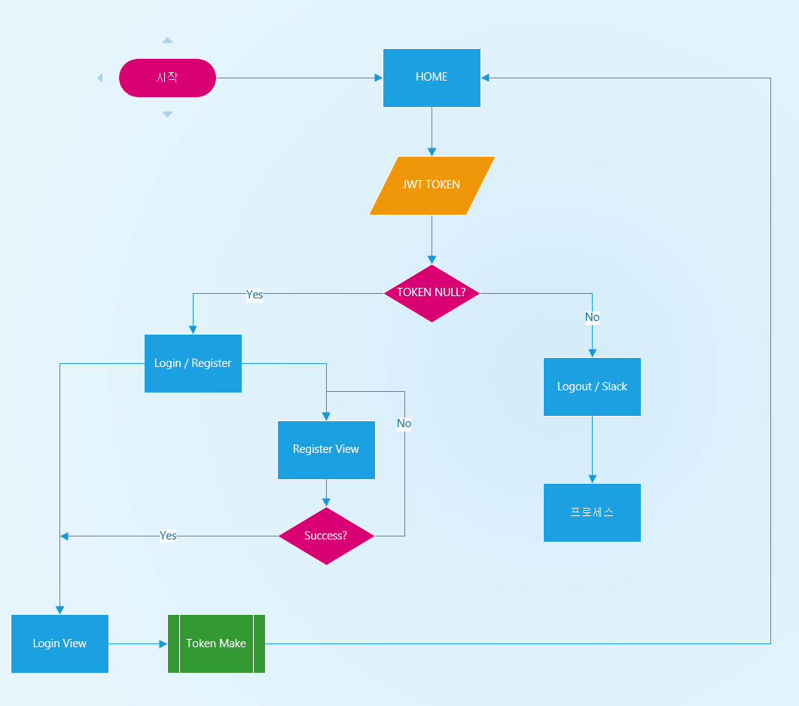
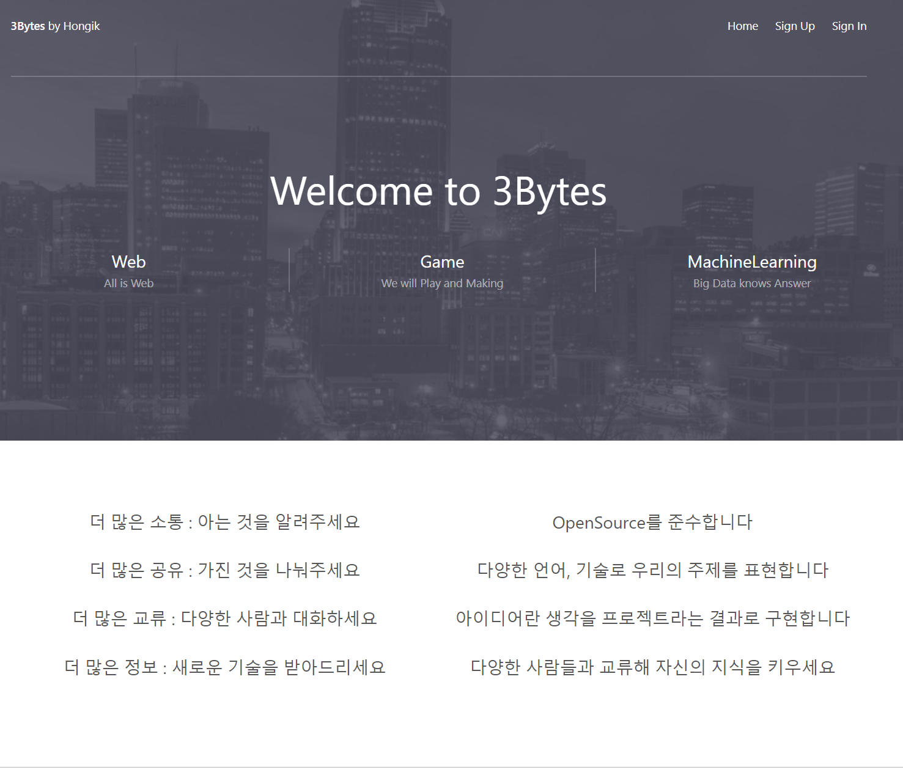
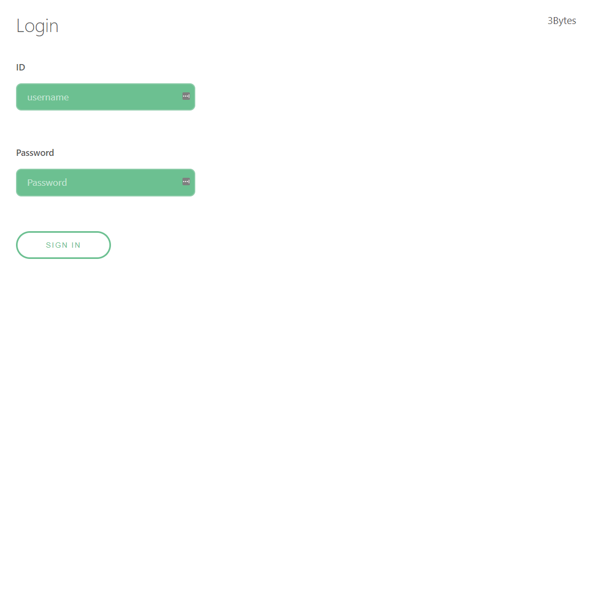
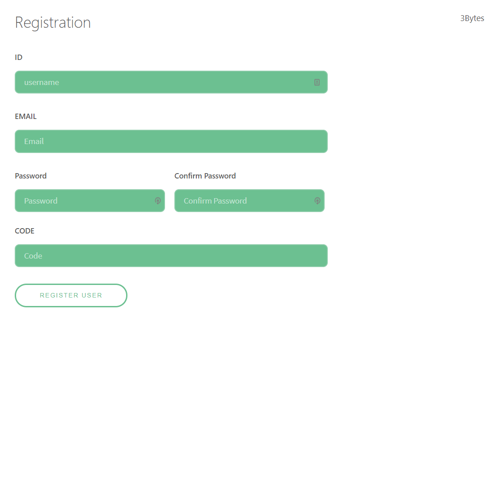
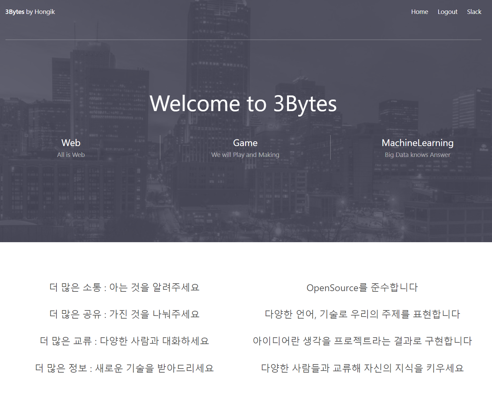

# React! React! React!

React 쓰고 싶었다... 원래 기존에 진행하던 프로젝트도 React를 사용하고 있었기 때문이다.

## 재밌게도...

이번 프로젝트에서 아마 배포 다음으로 공부를 많이 한 건 React라고 생각한다. Web공부를 시작한지 얼마 안되기도 했고 원래 Backend만 공부를 했기 때문에 Front를 제대로 공부해 볼 기회라고 생각하고 제작을 하게 되었다.

## 이러면 안됩니다

React만 그냥 했어야 했다...

React 에 제대로 해버릴 생각으로 Redux 패턴을 입힌 React + Redux를 처음으로 시도하면서 삽질과 에러의 산을 만나고 해결하긴 했다.

## 뭘 알면 좋을까?

React 하면서 제일 헷갈렸던 부분은 아마 Life Cycle과 Browser에서 Rendering이 된다는 것이었다.

물론 지금 설계는 SPA로 되어있기 때문에 CSR로 되어있지만 조금 더 사이트의 규모를 키우고 검색 노출을 위해 SSR을 메인 페이지에 구현하게 될 예정이다.

React를 하면 당연히 DOM에 대해서는 알아야 하고 추가적으로 볼만한 부분은 LifrCycle인데

일단 React의 Life Cycle을 보면

prop에 대한 event가 있을경우 생기는 과정에서 몇번 에러가 있었던 걸로 기억한다. 저 부분을 제대로 숙지하지 않고 개발하면서 Login Failed 시 아무런 error message가 view에 출력되지 않아서 고생했었다.

## 단순하게 설계

인증 과정을 저런 식으로 진행 할 예정이었기 때문에 설계 후, 개발을 했고 Redux 패턴을 넣어서 설계를 했다.

메인페이지다 Template는 만들 재능이 없으니 Free Template를 적당히 수정해 사용했다.

정말 별거 없는 Login 창

Register는 좀 특이한대, Slack Email 기능을 위해서 Code 입력하는 부분을 만들고 운영진이 알려준 Code가 없으면 가입을 못하는 처리를 해 두었다. 현재 이 부분은 미완이기 때문에 계속 기능을 추가해야 한다.

Login시 Header Menu가 바뀌는 것을 확인할 수 있다.

## 앞으로..

빠르게 만들다 보니 빠진 기능이 많다. 예를들어 가입이 안되면 왜 안되는지 안알려 준다든지... 비밀번호 찾기 기능도 없다든지...

하지만 빠르게 만든 후 빌드 테스트 까지 진행하는게 목적이었기 때문에 Core한 부분만 개발하고 넘어가기로 했다. 이어서 Django로 백엔드를 개발했다.

## Github

[**3BytesHomepage-Frontend**](https://github.com/mooncinnamon/3BytesHomepage-Frontend)