# 3Bytes 홈페이지 구축기 - Devops 구축 

 일단 Jenkins를 사용하는 시점은 뒤에 있겠지만 잠시 새벽에 잠이 안와서 구축을 해두었다.


## AWS + Jenkins + React + Spring

배포관리용으로 Jenkins를 사용해보기로 했다. 

항상 사용해봐야지 하고 해본적이 없기 때문에 짧게 끝내는 프로젝트의 경우 Jenkins까지 사용 가능할 것이라는 기대가 있었다.

Jenkins의 Slave는 Docker로 하려고 하였으나 Master는 Docker와 Native중 무엇으로 할 까 고민하다가 나중에 의존성 문제가 생길 수 있으니 Docker로 돌리기로 했다. 개인적으로 한 서버에서 여러작업을 해야하는 경우 다 Docker로 돌리려고 하는 경향이 있어서 이기도 했다.


서버에 있는 모든 docker container는 docker-compose 로 관리하기 때문에 docker-compose를 만들고 haproxy 때문에 jenkins의 context만 변경하기로 했다.

그 후 설치 하면 바로 Jenkins Master의 경우는 설치가 된다. 가볍게 에러를 무시하고 실행을 해서 첫 화면을 보면

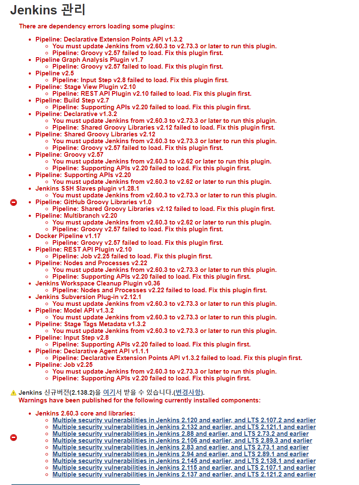

[업데이트 하세요 손님]

기존의 image에 있는 jenkins의 버전이 낮아 업데이트가 필요하다. Jenkins container에 있는 war을 업데이트 하고 설정을 시작하기로 했다.

```bash
docker exec -it -u 0 "container name" /bin/bash
```

먼저 docker container 내부에서 작업해야 하기 때문에 container 에 접근한다 여기서 '-u 0' 옵션은 root 권한 획득이다.

```bash
cd /tmp
wget "Jenkins War URL"
```

tmp 폴더라 이동 후, jenkins.war 파일을 다운받자.

```bash
mv ./jenkins.war /usr/share/jenkins
```

기존에 있는 war 파일을 업데이트 된 war 파일로 교체해주고

```bash
chown jenkins:jenkins /usr/share/jenkins/jenkins.war
```

권한 문제를 해결해준다.

```bash
exit
docker restart "container name"
```

그 후 컨테이너를 재 실행 시켜주면

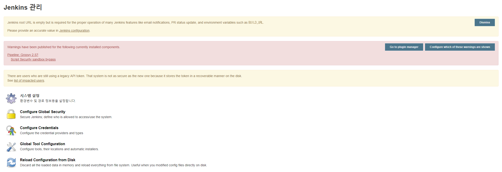

업데이트를 성공하셨습니다!


밤에 작업하니까 피곤하네요 그래도 끝내놓고 자기 위해 계속 해봅시다.


## 나는야 에러잡이 새

저 빨간박스가 신경쓰이니 이제 에러를 잡아봅시다

"Warnings have been published for the following currently installed components. "

plugin 관련 에러인데 설치 중에 pipline 쪽에서 에러가 있더니 이런 문제가 발생했나 봅니다. 플러그인 업데이트를 하고 재시작을 해줍시다.

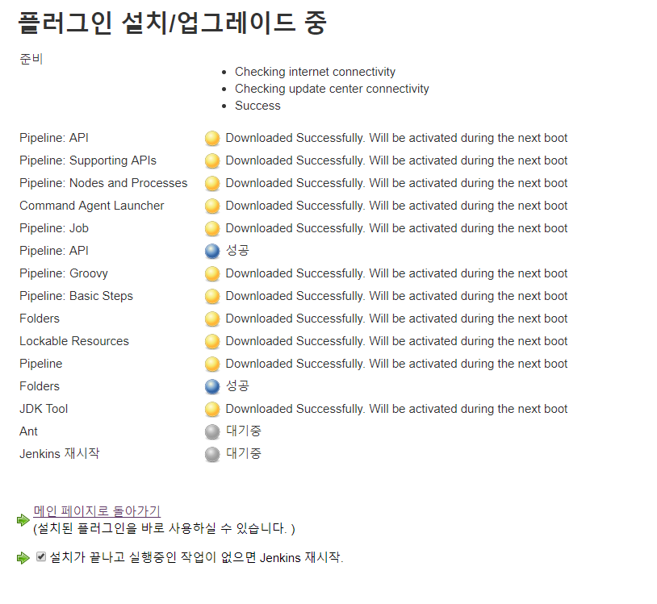

뭔가 기분 좋은 화면입니다...


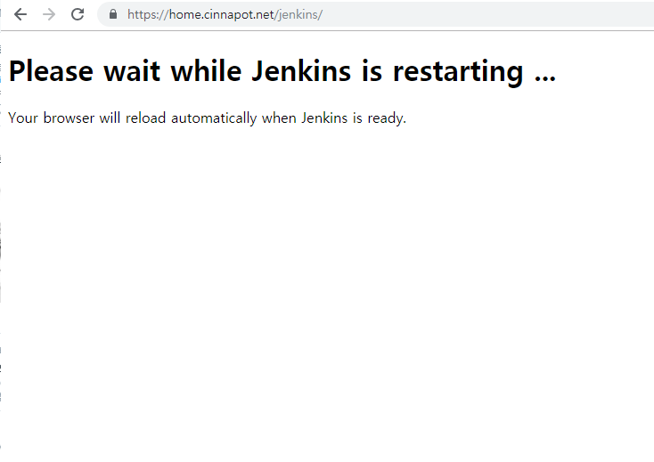

빨리 들어가면 이런 화면을 볼 수 있습니다.

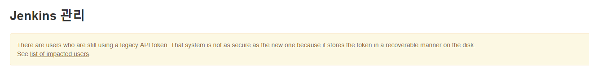

오 잡혔네요 이제 마지막 이슈만 잡아봅시다 API 토큰 문제인데요. 레거시 토큰을 제거하면 해결됩니다.

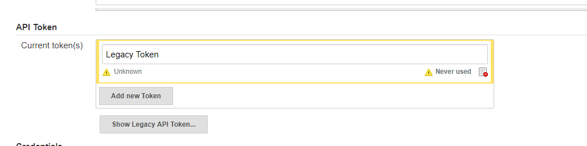

[제거하자]

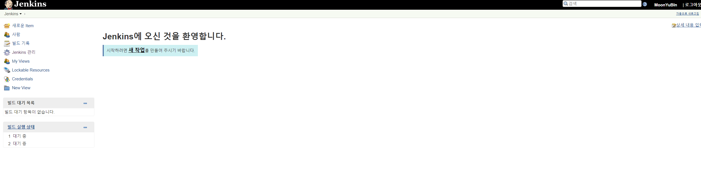

자 이제 Jenkins의 초기 설정은 끝났습니다.


## Github을 써볼까?

자 이제 깔끔한 Jenkins를 구축할 수 있었습니다. 그러면 Github 연동을 해볼까요.

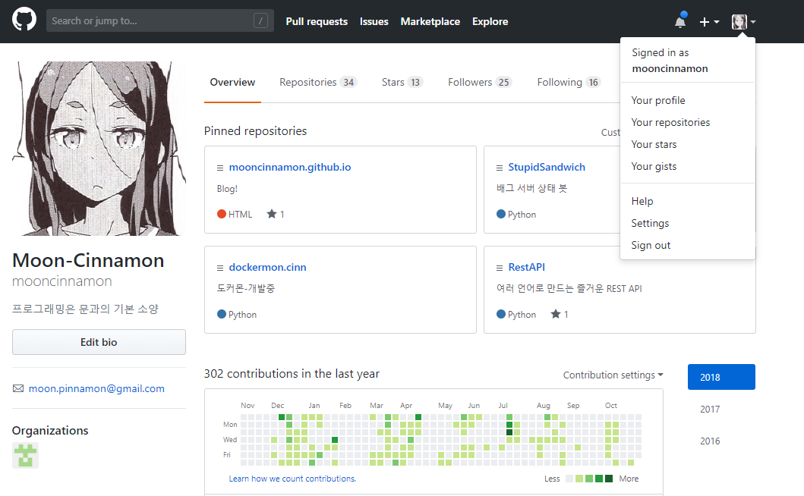

깃헙에 들어가 settings 에 들어갑시다

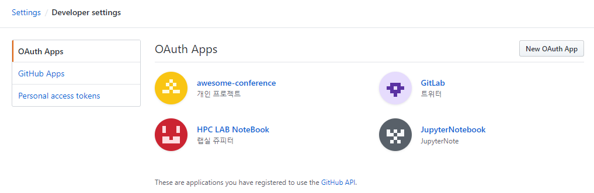

Developer settings에 들어가면 이런식으로 볼 수 있는데요 personal access token을 들어갑시다.

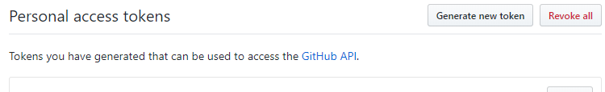

Generate new token을 클릭

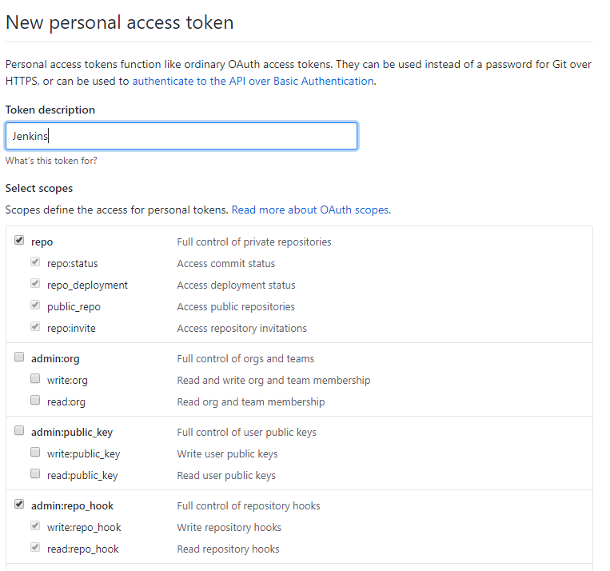

repo와 repo_hook을 클릭하고 저장해줍시다. 그러면 키가 발급되는데 복사해둡시다.

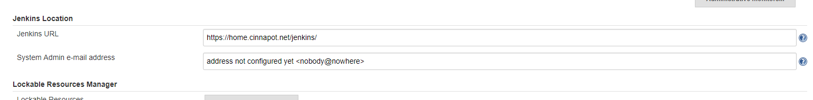

이 부분에 보통 비어있거나 IP로 되어있을텐데 외부접근용 주소를 입력해줍시다

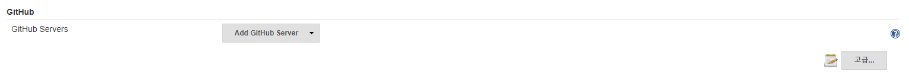

이제 깃헙탭에서 작업합니다.

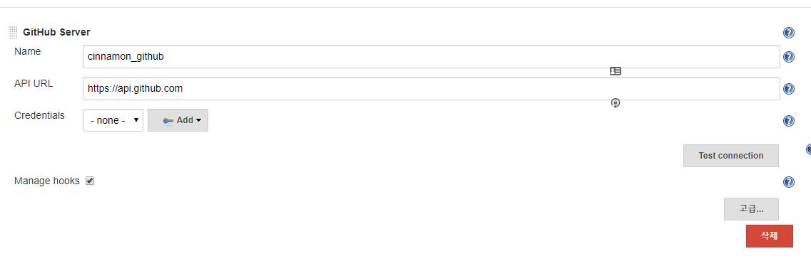

Add 부분에서 Manage hooks 체크 확인 후 Add를 눌러서 Jenkins를 눌러줍시다.

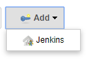

[네 이거요...]

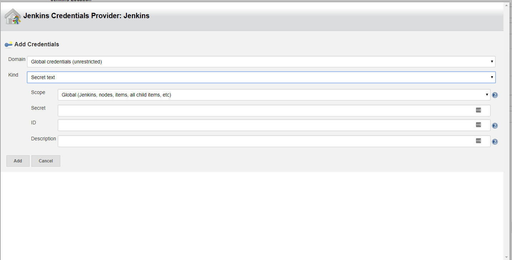

Kind -> Secret text로 변경 후 깃헙 아이디와 secret을 입력해 줍시다.

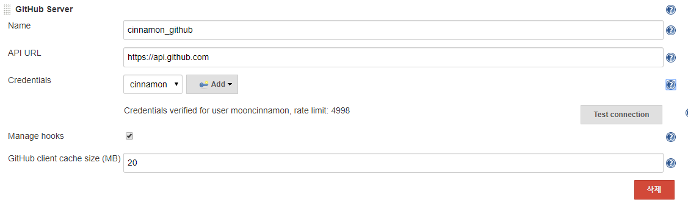

성공!

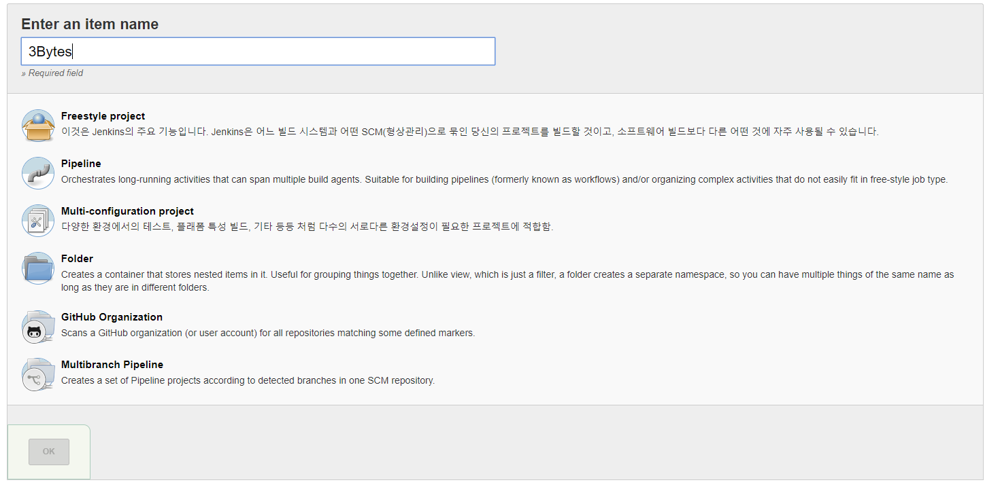

Jenkins에 Github Project를 등록시켜 봅시다 Project를 만들고

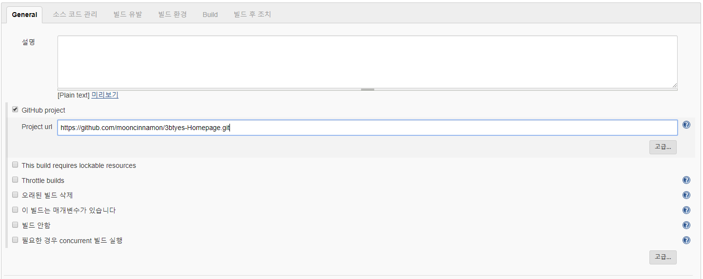

Github 프로젝트 클릭 후 등록

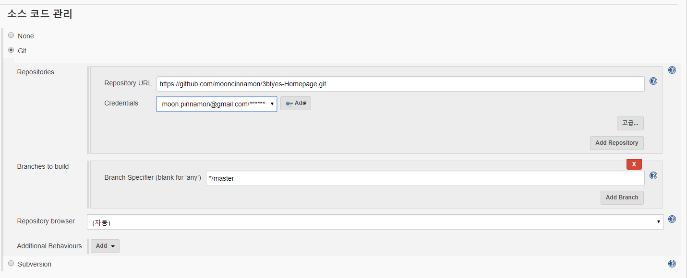

소스코드 관리에도 똑같이 진행 후, ADD에 Github 계정 로그인 후 등록

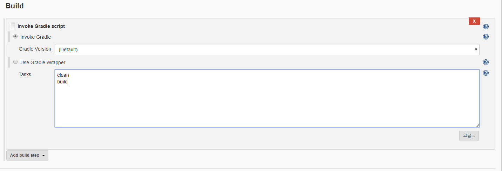

마지막으로 Gradle로 빌드할 것이기 때문에 Build 등록했습니다.


## 앞으로..

Jenkins는 일단 docker-compose를 만들어 두었고 동작을 확인했으니 이제 정말 개발로 가야겠죠 Reac를 써봅시다.